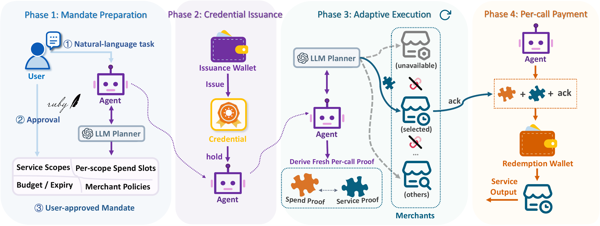
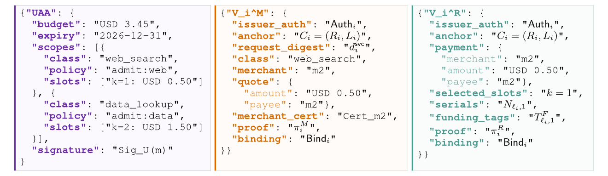

<div align="center">

# 💳 MinMandate

**Private Task-Scoped Payment Authorization for Adaptive Agent Workflows**

[TL;DR](#tldr) • [Overview](#overview) • [Code Map](#code-map) • [Setup](#setup) • [Run Experiments](#run-experiments) • [Citation](#citation)

[[Paper](./paper/minmandate_preprint.pdf)] [[Source](./paper/minmandate_preprint.tex)]


</div>

<p align="center">
  
</p>

<p align="center"><em>MinMandate lets an agent adaptively choose policy-compliant merchants while deriving fresh, verifier-specific payment views for each paid call.</em></p>

<a id="tldr"></a>
## ✨ TL;DR

**MinMandate** is a privacy-preserving payment authorization framework for adaptive, multi-merchant agent workflows. A user approves the task bounds once; the agent can then select eligible merchants at runtime without exposing a stable cross-merchant payment identifier.

| What to know | MinMandate in one line |
| --- | --- |
| 🎯 Authorization | One user-approved mandate covers service scopes, merchant policies, budget, spend slots, and expiry. |
| 🔄 Adaptability | The agent can switch among policy-compliant merchants without requesting a new user signature. |
| 🕶️ Privacy | Fresh service and spend views avoid adding a stable payment-layer join handle across merchants. |
| 🔒 Safety | Per-call consistency binding and single-use spend evidence bind authorization to the request, quote, and redemption. |
| 🧪 Evaluation | AgentDojo-based workflows, merchant unavailability, stable-handle privacy ablation, and protocol overhead. |

When 50% of merchants are unavailable, MinMandate improves task success by **32.7 percentage points on average** across four tested planners over an AP2 baseline that preauthorizes one merchant per service class. Reintroducing a reusable public payment-layer handle raises attacker task-recovery success by **27.4 percentage points on average**.

<a id="overview"></a>
## 🔍 Overview

Existing agentic-payment credentials commonly fix merchant choices before execution or expose reusable identifiers across paid calls. Those choices are awkward for long-running agent workflows: the best merchant may only become clear after intermediate results arrive, while a stable identifier can let observers join calls and infer the user's broader task.

MinMandate combines two mechanisms:

1. **Task-scoped payment authority** authorizes service classes, merchant-selection constraints, a total budget, per-scope spend slots, and expiry without naming every merchant in advance.
2. **Unlinkable per-call views** derive fresh service and spend proofs for each call, disclosing only the authorization facts required by the relevant verifier.

<p align="center">
  
</p>

<p align="center"><em>Canonical protocol objects: the user-approved authority is transformed into verifier-specific service and redemption views linked only by a fresh per-call binding.</em></p>

The repository contains the implementation and experiment code used for the paper, together with a self-contained preprint source package.

<a id="code-map"></a>
## 🗺️ Code Map

| Path | Purpose |
| --- | --- |
| [`experiments/`](./experiments/) | MinMandate contracts, policies, adapters, schemas, and experiment drivers. |
| [`experiments/scripts/`](./experiments/scripts/) | Merchant-availability, privacy-ablation, overhead, analysis, and table-rendering entry points. |
| [`experiments/extensions/`](./experiments/extensions/) | Merchant-scale and protocol-scaling appendix experiments. |
| [`ap2_baseline/`](./ap2_baseline/) | Minimal AP2 baseline implementation used by the matched evaluations. |
| [`rust_protocol/`](./rust_protocol/) | Rust implementation used by the cryptographic protocol and scaling measurements. |
| [`paper/`](./paper/) | Self-contained LaTeX source, bibliography, figures, and compiled preprint. |
| [`materials/`](./materials/) | Figures used in this README. |

### Result-to-code map

| Paper result | Execution / preprocessing | Analysis |
| --- | --- | --- |
| Main task-utility table | `build_merchant_catalog.py`, `validate_source_pairing.py`, `run_merchant_availability.py`, `run_coverage_replay.py` | `analyze_utility.py`, `bootstrap_task_effects.py`, `render_utility_table.py` |
| Stable Handle privacy ablation | `run_stable_handle_ablation.py` | Emitted JSON/JSONL summaries |
| Runtime and communication overhead | `measure_overhead.py` | Emitted CSV/JSON summaries |
| Merchant-scale appendix experiment | `merchant_scale.py` | `merchant_scale.py`, `plot_merchant_scale.py` |
| Protocol-scaling appendix experiment | `protocol_scaling.py` | `plot_protocol_scaling.py` |

<a id="setup"></a>
## ⚙️ Setup

The recorded experiment environment used Ubuntu 24.04, Python 3.12.3, Rust 1.96.0, and OpenSSL 3.0.13.

```bash
git clone https://github.com/Zora-G/MinMandate.git
cd MinMandate

python3 -m venv .venv
source .venv/bin/activate
python -m pip install --upgrade pip
python -m pip install -r requirements.txt

cargo build --release --locked --manifest-path rust_protocol/Cargo.toml
```

On macOS with Homebrew OpenSSL, expose the library path when building or
testing:

```bash
export LIBRARY_PATH="$(brew --prefix openssl@3)/lib"
```

The dependency on Google's AP2 reference code is pinned to a specific commit in [`requirements.txt`](./requirements.txt). The experiment harness is designed for offline replay and rejects unexpected credential-bearing environment variables.

<a id="run-experiments"></a>
## 🚀 Run Experiments

Inspect the available commands before supplying local frozen inputs:

```bash
python -m experiments.scripts.run_merchant_availability --help
python -m experiments.scripts.run_stable_handle_ablation --help
python -m experiments.scripts.measure_overhead --help
```

Plan the merchant-scale appendix experiment:

```bash
python -m experiments.extensions.merchant_scale plan
```

Validate merchant-scale inputs and runtime:

```bash
python -m experiments.extensions.merchant_scale preflight \
  --root <input-root> \
  --source-root <source-root> \
  --source-prefixes <comma-separated-prefixes> \
  --rust-binary rust_protocol/target/release/minmandate-rs \
  --policy-config <issuer-policy.yaml>
```

Run the selected-slot and credential-size scaling implementation:

```bash
cargo build --release --locked --manifest-path rust_protocol/Cargo.toml
python -m experiments.extensions.protocol_scaling \
  --binary rust_protocol/target/release/minmandate-rs \
  --output protocol_scaling_output \
  --runs 5
```

Focused implementation checks:

```bash
python -m compileall -q ap2_baseline experiments
cargo test --locked --manifest-path rust_protocol/Cargo.toml
```

### Reproducibility notes

- Use paired task seeds and the same frozen merchant-availability masks for every compared condition.
- The included deterministic key profile is test-only and must not be used for production funds or credentials.
- Large frozen inputs and generated result artifacts are not duplicated in Git history. The scripts accept explicit input and output roots so archived experiment bundles can be mounted locally.
- See [`SECURITY.md`](./SECURITY.md) before adapting the code to any real payment system.

<a id="citation"></a>
## 📚 Citation

If you use this code, please cite the MinMandate manuscript. GitHub can also read the repository metadata from [`CITATION.cff`](./CITATION.cff).

```bibtex
@misc{gao2026minmandate,
  title  = {MinMandate: Private Task-Scoped Payment Authorization for Adaptive Agent Workflows},
  author = {Gao, Ge and Yu, Haining and Liu, Zhichao and Zhan, Dongyang and Zhu, Yuanxiao and Hua, Zhongyun},
  year   = {2026},
  note   = {Manuscript}
}
```

<a id="license"></a>
## 📄 License

This repository is currently shared for private research collaboration. A public-release license will be added before the repository is made public. Third-party dependencies retain their own licenses.
